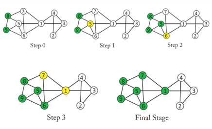

# 망 위상 특성에 따른 정보 확산 분석 알고리즘
&nbsp;본 연구에서는 네트워크의 유형과 구조적인 특성이 네트워크의 동적인 정보 확산이나 전파에 어떻게 영향을 미치는지를 시뮬레이션을 통해 분석해 보았다. 이를 위해 네트워크의 구조적인 유형(Scale-Free, Small-World, 랜덤 네트워크)과 위상적 특성을 잘 나타내주는 네트워크 생성 모델을 이용하여 다양한 종류의 네트워크를 생성하고 Linear Threshold 모델을 이용하여 정보 확산 시뮬레이션을 수행하였다. 본 연구 결과 네트워크의 정보 확산이나 파급에 영향을 미치는 중요한 네트워크의 위상적 성질을 군집화 계수가 아닌 슈퍼 허브노드의 존재를 가능케 하는 노드 차수의 Power-Law로 나타났다. 따라서 Power-Law 성질로 인해 슈퍼 허브 노드가 존재하는 Scale-Free 네트워크의 정보 확산 속도가 다른 종류의 네트워크에 비해 빠르다는 사실도 확인 하였다. 또한 Small-World나 Scale-Free 네트워크의 경우 초기 노드 선정은 차수 중심성이 높은 노드를 선정 하는 것이 임의로 선정하는 것 보다 정보 확산 속도가 매우  빠르다는 것을 확인 하였다.
 

